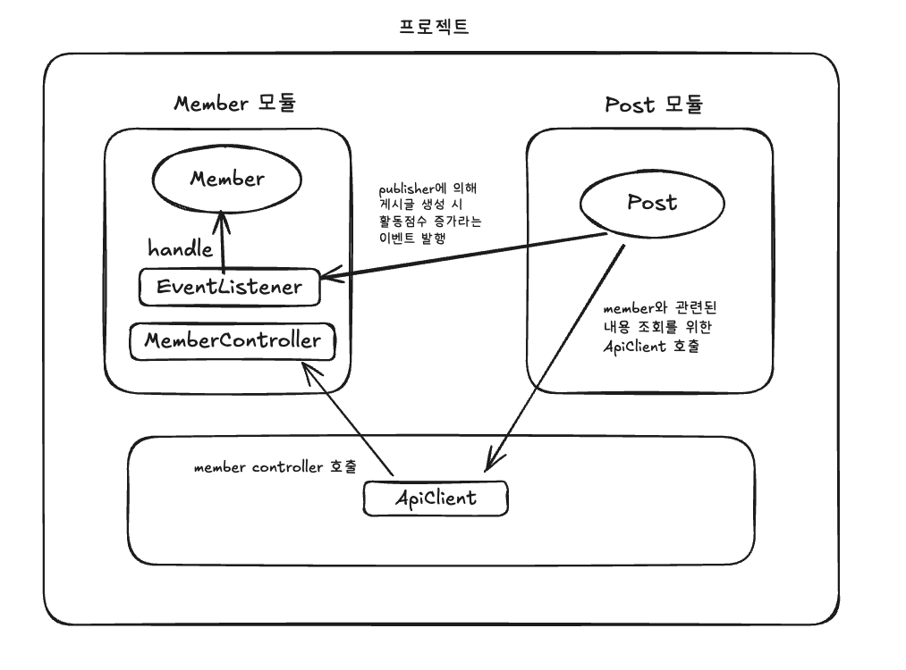
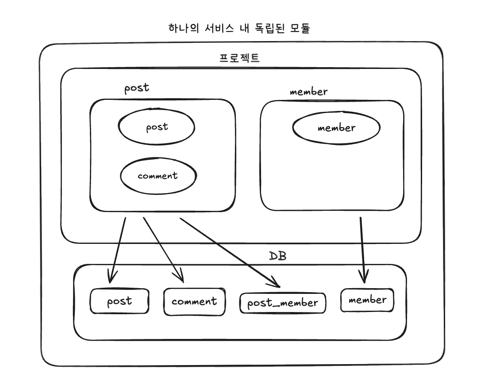

## DDD & MSA

### DDD
* Domain Driven Design: 도메인 주도 설계
* 업무 규칙을 팀의 언어로 경계 안에 모아두는 것

### 주요 개념
* bounded context
  * 최대한 독립적이고 폐쇄적인 모듈
  * 바운디드 컨텍스트로 나뉘면 각 모듈을 이해하기 쉬워진다. 즉, 유지보수 하기가 쉬워진다!
  * 결합도를 낮추고 응집도를 높이자
* 유비쿼터스 언어
  * 같은 bounded context 내에서는 같은 이름을 쓸 것
  * 현업(실무담당자)이 사용하는 언어를 사용해야 한다.
  * ex. 상품을 정의할 때 product, goods 등 개념이 혼동되면 안됨.
* 규칙은 한 곳에 모으기! 즉, 업무 규칙이 바뀌면 해당 bounded context 만 고치게 만들기

### 요약
DDD란 결합도는 낮추고 응집도를 높일 수 있도록 각 도메인별로 최대한 독립적이고 폐쇄적으로 나누어 설계하는 소프트웨어 설계 방법


### spring event 를 활용하여 bounded context 간 결합도 분리
* event class: 이벤트를 처리하는데 필요한 데이터
* event publisher: ApplicationEventPublisher 빈을 주입하여 publishEvent() 메서드를 통해 생성된 이벤트 객체를 넣어줌. 이벤트를 발행했다는 사실만 알려줌.
* event listener: @EventListener 어노테이션을 통해 발생하는 이벤트 캐치. 이벤트에 대한 후속 조치는 다 listener에 속한 모듈에서 해줘야 함(loosely coupled)

### bounded context 내부를 DDD 형태로 구조화
```
📦 boundedContext
├── 📁 in: 변화의 시작점, 외부의 입력신호에 따라서 어떠한 일을 시작하는 영역
│   ├── 📁 controller: 외부의 입력 신호를 받아서 처리하는 영역
│   ├── 📁 eventListener: 이벤트를 받아서 처리하는 영역
│   └── 📁 scheduler: 스케줄러를 통해서 주기적으로 실행되는 영역
│
├── 📁 app: 파사드와 서비스가 존재하는 영역 (비즈니스 로직)
│   ├── 📁 facade: in의 클래스는 유즈케이스에 바로 접근할 수 없고 파사드를 통해야 한다.
│   └── 📁 usecase: 유즈케이스는 비즈니스 로직을 구현하는 영역
│
├── 📁 domain: 순수 비즈니스 로직을 구현하는 영역 / 특정 비즈니스 영역(문제 영역) 그 자체
│
└── 📁 out: 변화의 결과를 외부에 반환하는 영역
    ├── 📁 repository: 데이터를 저장하고 조회하는 영역
    └── 📁 apiClient: 외부 서비스와 연동하는 영역
```

### RsData 도입
RsData(ReSponse data) : API 응답을 구조화하기 위해 사용하는 객체
* 일관된 응답 구조
* 상태 코드와 메시지 포함
* 데이터 타입의 유연성: 제네릭을 사용하여 다양한 데이터 타입 포함 가능
* 가독성 향상
``` 
// 예시
public class RsData<T> {
  private final String resultCode;
  private final String msg;
  private final T data;

  public RsData(String resultCode, String msg) {
    this(resultCode, msg, null);
  }
}
```

### 타 모듈간 메서드 호출 금지를 위한 ApiClient 활용
* WebClient: Spring WebFlux 에서 제공하는 HTTP 요청을 보내기 위해 사용하는 인터페이스
* RestClient: 동기식 HTTP Client
  

* post가 생성 시 member의 활동점수 3점 증가
1. Post 모듈 내 publisher 에 의해 이벤트 발행
2. EventListener가 이벤트를 캐치해서 이벤트를 처리함

* post가 생성 시 member 정책에 해당하는 내용 같이 전달
1. Post 모듈 내에서 공통 모듈에 있는 ApiClient 를 호출
2. ApiClient 에서 memberController 로 HTTP 요청
3. controller가 요청받은 내용 처리


### 현재 프로젝트 구조 (모놀리식 구조지만 모듈별로 분리)



### DB 이중화 (Replication)
* 고가용성 보장: DB 서버의 장애 시, 다른 복제본 서버가 즉시 서비스 역할을 할 수 있어 서비스 중단 시간을 최소화
* 성능 향상: 읽기 전용 작업을 여러 복제본에 분산시켜, DB 성능을 향상
* 데이터 무결성 보장: 여러 장소에 데이터를 복제하여, 데이터 손실 시 복구할 수 있는 가능성 높임

현재 프로젝트에서는 회원의 조회가 압도적으로 많아 회원이 생성될 때나 수정될 때 같이 동기화 시켜줌 (member -> post_member)